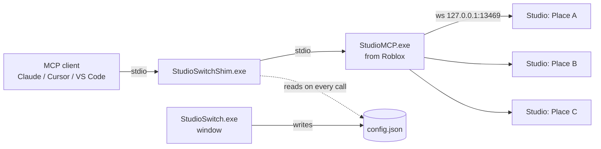

# StudioSwitch

**Choose which open Roblox Studio windows your AI assistant can use.**

Roblox Studio's built-in MCP server connects *every* open Studio window to your MCP client
(Claude, Cursor, VS Code, …). With three or four places open, the assistant has to pick a
`studio_id` on every call, and it can easily run code in the wrong place.

StudioSwitch is a small Windows app that sits in between. Tick the places the assistant may see,
star a default, and switch while you work: no closing Studio windows, no restarting the assistant.

- ✅ **Hide places**: unticked Studios disappear from `list_roblox_studios`, and any call aimed at one is refused before it reaches Studio.
- ⭐ **Default place**: calls that leave out `studio_id` go to your starred Studio (or the only ticked one).
- 🔁 **One-click switch**: *Use only this one* hides everything else and stars the selection.
- ⚡ **Live**: changes apply to sessions that are already running, on their next Studio call.
- 📋 **Status at a glance**: place name, place ID, Edit/Play mode, and whether each window is connected.
- 🧩 **Works with several clients**: finds the Roblox Studio entry in Claude, Claude Code, Cursor, VS Code, Windsurf and Gemini CLI configs.

> Not affiliated with Roblox Corporation or Anthropic. StudioSwitch builds on the behaviour of
> Roblox's `StudioMCP.exe` 1.0 (September 2026); a future Studio update could change that.

## How it works



1. **Hook** rewrites the Roblox Studio server entry in your MCP client's config so it launches
   `StudioSwitchShim.exe` instead of Roblox's `mcp.bat`. Only that entry changes, a backup of the
   file is saved next to it, and **Unhook** restores the original byte-for-byte.
2. The shim starts the real `StudioMCP.exe` and relays everything unchanged, except that it:
   - filters the `list_roblox_studios` result down to the Studios you ticked, marks your default with `"default": true`, and notes how many are hidden;
   - refuses calls whose `studio_id` belongs to a hidden Studio;
   - fills in `studio_id` for calls that omit it (and marks it optional in the tool schemas).
3. The window reads live status through its own connection to the same local MCP hub and saves
   your choices to `%LOCALAPPDATA%\StudioSwitch\config.json`. The shim re-reads that file whenever it changes.

Studios are identified by **place ID**, so your choices survive closing and reopening a place.

## Install

1. Download `StudioSwitch.exe` from the [latest release](../../releases/latest) and put it somewhere permanent.
2. Make sure Roblox Studio's MCP server is set up in your client (Studio → Assistant settings → MCP).
3. Run `StudioSwitch.exe` and click **Hook**.
4. Restart your MCP client once (e.g. fully quit and reopen the Claude app).

Keep the window open while you work and tick or untick places as you go.

> **Windows SmartScreen** may warn because the exe isn't code-signed. Choose *More info → Run anyway*,
> or build it yourself from source (below).

## Build from source

Windows 10/11 already includes everything needed (the .NET Framework 4.x C# compiler). No SDK, no NuGet.

```powershell
powershell -NoProfile -ExecutionPolicy Bypass -File build.ps1
```

This produces `StudioSwitch.exe` (with the shim embedded) and `obj\StudioSwitchShim.exe`.

## Command line

```text
StudioSwitch.exe                         open the window
StudioSwitch.exe status [config.json …]  show hook status of every known (or given) config
StudioSwitch.exe hook   [config.json …]  hook them
StudioSwitch.exe unhook [config.json …]  restore them
```

## Supported MCP clients

| Client | Config file |
| --- | --- |
| Claude app | `%APPDATA%\Claude\claude_desktop_config.json` |
| Claude app (Microsoft Store) | `%LOCALAPPDATA%\Packages\Claude_*\LocalCache\Roaming\Claude\claude_desktop_config.json` |
| Claude Code | `%USERPROFILE%\.claude.json` (global and per-project entries) |
| Cursor | `%USERPROFILE%\.cursor\mcp.json` |
| VS Code / Insiders | `%APPDATA%\Code\User\mcp.json`, `%APPDATA%\Code - Insiders\User\mcp.json` |
| Windsurf | `%USERPROFILE%\.codeium\windsurf\mcp_config.json` |
| Gemini CLI | `%USERPROFILE%\.gemini\settings.json` |

An entry is recognised by what it runs (`StudioMCP.exe`, or `mcp.bat` in the Roblox folder),
not by its name. Other clients work too: pass the config path to `StudioSwitch.exe hook <path>`.

## Files StudioSwitch writes

| Path | What |
| --- | --- |
| `%LOCALAPPDATA%\StudioSwitch\config.json` | your choices: `{"hidden": [placeIds], "pinned": placeId}` |
| `%LOCALAPPDATA%\StudioSwitch\StudioSwitchShim.exe` | the shim your clients launch |
| `%LOCALAPPDATA%\StudioSwitch\hooks.json` | original config entries, for Unhook |
| `<config>.studioswitch-<timestamp>.bak` | a copy of each config file before it was edited |

Set `STUDIOSWITCH_DIR` to use a different folder instead of `%LOCALAPPDATA%\StudioSwitch`.

## Troubleshooting

**The assistant still sees a place I unticked.** The client is still running the Studio MCP it
started before you hooked. Restart it once. If the window shows *not hooked* again afterwards, the client
rewrote its config on exit: click **Hook** and restart once more.

**A Studio window shows "NOT connected".** Turn the MCP server on in that window's Assistant settings,
and make sure the place has finished loading.

**"Access is denied" when starting StudioSwitch (or MCP tools stop working after hooking).**
Some hardened setups enable the Microsoft Defender attack surface reduction rule *Block executable files
from running unless they meet a prevalence, age, or trusted list criterion*. A small unsigned tool can
never meet it. Check *Windows Security → Protection history*; if that rule blocked StudioSwitch, an
administrator can allow exactly its two files:

```powershell
Add-MpPreference -AttackSurfaceReductionOnlyExclusions "C:\path\to\StudioSwitch.exe","$env:LOCALAPPDATA\StudioSwitch\StudioSwitchShim.exe"
```

## Uninstall

Click **Unhook** (or run `StudioSwitch.exe unhook`), restart your MCP clients, then delete
`StudioSwitch.exe` and `%LOCALAPPDATA%\StudioSwitch`.

## Tests

```powershell
py tests\test_hooks.py                                    # synthetic configs in a temp folder
py tests\test_shim.py "$env:LOCALAPPDATA\StudioSwitch\StudioSwitchShim.exe"   # needs 2+ Studio windows open
```

Both use a temporary `STUDIOSWITCH_DIR`, so your real settings and configs are never touched. The
shim test's only action inside Studio is a read-only `return game.PlaceId`.

## License

[MIT](LICENSE)
